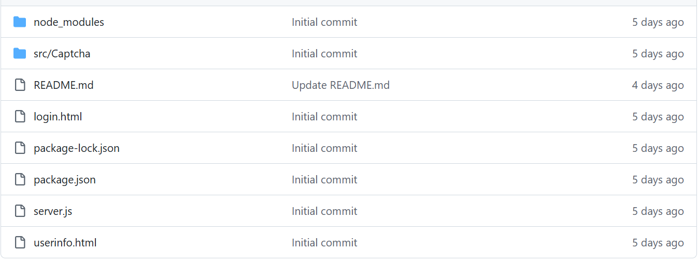
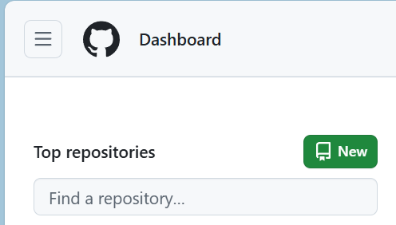
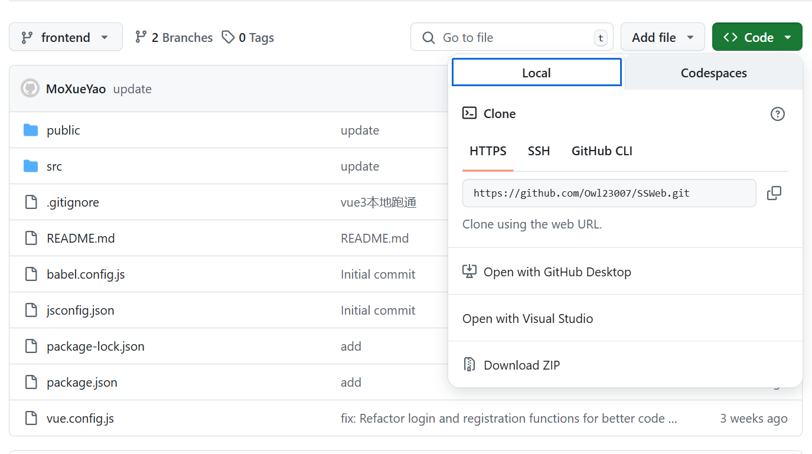

# GitHub食用指南
很多大学新生都会遇到一个问题——老师要求把代码上传到仓库。可是，什么是仓库？我们又该如何实现呢？通过本文，你将学习如何使用GitHub来管理代码！

## 目录
1. [介绍](#介绍)
    1. [什么是GitHub？](#1-什么是github)
    2. [什么是仓库？](#2-什么是仓库)
2. [快速开始](#具体操作)
    1. [下载Git](#1-下载git)
    2. [注册GitHub](#2-注册github)
    3. [初始化本地仓库](#3-初始化本地仓库)
    4. [推送到远程服务器](#4-推送到远程服务器)
3. [后续操作](#后续操作)
    1. [克隆远程仓库](#1-克隆远程仓库)
    2. [拉取最新更改](#2-拉取最新更改)
    3. [合并操作](#3-合并操作)

## 介绍

### 1. 什么是GitHub？

GitHub是一个基于Git的代码托管平台，允许开发者存储、管理和共享代码仓库。

现在比较常见的代码仓库有Gitee、GitHub等


Gitee：https://gitee.com/


GitHub：https://github.com/

两个网站功能上区别不大，Gitee服务器在中国境内，速度更快更方便，GitHub能提供更好的社区支持。

本文档将基于GitHub来讲解如何使用Git来进行代码管理的讲解。

如果你想在国内访问GitHub，可以下载[Watt Toolkit](https://steampp.net/)提供的代理支持。

### 2. 什么是仓库？

仓库（Repository）是一个项目的存储空间，可以包含项目的所有文件和每个文件的修订历史记录。你可以将仓库看作是一个项目的文件夹。

在初次初始化后将会在项目文件夹下面生成.git文件，这个文件夹包含了所有的版本控制信息。


## 具体操作

### 1. 下载Git

Git是一个免费的开源分布式版本控制系统。一切对仓库的操作都是基于git的操作。你可以从[Git官方网站](https://git-scm.com/)下载并安装Git。

#### 从git官网下载


1. 打开[Git官方网站](https://git-scm.com/)。
2. 点击页面上的“Download”按钮，系统会自动检测你的操作系统并提供相应的下载链接。
3. 下载完成后，运行安装程序并按照提示完成安装。


我也在百度网盘上上传了最新版的git 64位安装程序：
 https://pan.baidu.com/s/1bqaT_GcfcyetGnHyK7r5_g?pwd=vhhs 

#### 配置Git

安装完成后，你需要进行一些基本配置来设置你的Git环境。

1. **设置用户名和邮箱**

   Git会使用这些信息来记录每次提交的作者信息。运行以下命令来设置你的用户名和邮箱(跳转github账户注册)：

   ```bash
   git config --global user.name "你的用户名"
   git config --global user.email "你的邮箱地址"
    ```

2. **验证配置**

    你可以使用以下命令来查看配置是否成功：
    ```bash
    git config --global --list
    ```

### 2. 注册Github

要使用GitHub来管理你的代码，首先需要注册一个GitHub账户。以下是注册步骤：

1. **访问GitHub网站**

   打开浏览器，访问[GitHub官方网站](https://github.com/)。

2. **创建账户**

    

   在GitHub首页，点击右上角的“Sign up”按钮，进入注册页面。

3. **填写注册信息**

   在注册页面，填写你的用户名、邮箱地址和密码，然后点击“Create account”按钮。

4. **验证邮箱**

   GitHub会向你提供的邮箱地址发送一封验证邮件。打开你的邮箱，找到这封邮件并点击其中的验证链接，完成邮箱验证。

5. **完成注册**

   根据页面提示，完成剩余的注册步骤，包括选择账户类型和设置个人偏好等。

注册完成后，你就可以登录GitHub并创建新的代码仓库了。

### 3. 初始化本地仓库

在你注册并登录GitHub后，可以开始在本地创建一个新的Git仓库，并将其连接到GitHub上的远程仓库。以下是具体步骤：

1. **创建本地项目文件夹**

   首先，在你的计算机上创建一个新的文件夹，用于存放你的项目文件。

2. **初始化Git仓库**

    在项目文件夹中初始化一个新的Git仓库：

    在当前文件夹打开cmd，在地址栏输入cmd，回车运行。

    

    运行：

    ```bash
    git init
    ```
    这将创建一个名为 .git 的隐藏文件夹，Git会在其中存储版本控制信息。

    

3. **在当前文件夹下进行项目更改并提交本地仓库**

    例如：

    1.创建README文件

    在项目文件夹中创建一个README.md文件，并添加一些描述信息：

        # 我的项目
        这是我的第一个GitHub项目。

    2.使用以下命令将README文件添加到Git索引中：
    ```bash
        git add README.md   //添加README.md到本地仓库
        /*或者*/
        git add .           //将当前文件夹添加到本地仓库
    ```
    3.提交更改

    将README文件的更改提交到本地仓库：
    ```
    git commit -m "你的提交信息"
    ```

    这个将会在仓库中显示提交的信息：
    
    


### 4. 推送到远程服务器

在你完成本地仓库的初始化和更改提交后，可以将这些更改推送到GitHub上的远程仓库。以下是具体步骤：

1. **连接到GitHub远程仓库**

    

   在GitHub上点击new创建一个新的仓库，然后将其URL复制下来。
   
   使用以下命令将本地仓库连接到GitHub上的远程仓库：
   

   ```bash
   git remote add origin https://github.com/your-username/your-repo.git
   ```
2. **推送更改**

    将本地仓库的更改推送到GitHub上的远程仓库：
    ```
    git push -u origin master
    ```

    这将把本地仓库中的所有提交推送到远程仓库的master分支。

3. **验证推送**

    推送完成后，你可以在GitHub页面上查看你的项目，确认所有更改已经成功上传。

    现在，你的本地仓库已经成功推送到GitHub上的远程仓库，你可以随时在本地进行更改并推送到远程仓库，以保持代码的同步和备份。

## 后续操作

同时github也是一个非常好的学习编程的网站，你可以查看他人的项目，并在本地进行部署。

### 1. 克隆远程仓库

如果你想在另一台计算机上继续你的项目、下载他人项目或者与他人协作，你需要克隆远程仓库。在仓库code里面来查看仓库url。



使用以下命令克隆远程仓库到本地：

```bash
git clone https://github.com/your-username/your-repo.git
```

这将创建一个包含远程仓库所有内容的本地副本。

### 2. 拉取最新更改

在多人协作的项目中，你需要定期拉取远程仓库的最新更改。使用以下命令拉取最新更改：

```bash
git pull origin master
```

这将从远程仓库的`master`分支拉取最新的更改并合并到你的本地分支。

### 3. 合并操作

在多人协作的项目中，不同的开发者可能会在不同的分支上工作。你需要将这些分支合并到主分支。以下是合并操作的步骤：

1. **切换到目标分支**

   首先，切换到你想要合并到的目标分支（例如`master`分支）：

   ```bash
   git checkout master
   ```

2. **合并分支**

   使用以下命令将另一个分支（例如`feature-branch`）合并到当前分支：

   ```bash
   git merge feature-branch
   ```

3. **解决冲突**

   如果在合并过程中出现冲突，Git会提示你解决冲突。打开冲突文件，手动解决冲突后，使用以下命令标记冲突已解决：

   ```bash
   git add conflict-file
   ```

4. **提交合并**

   最后，提交合并结果：

   ```bash
   git commit -m "合并分支 feature-branch"
   ```